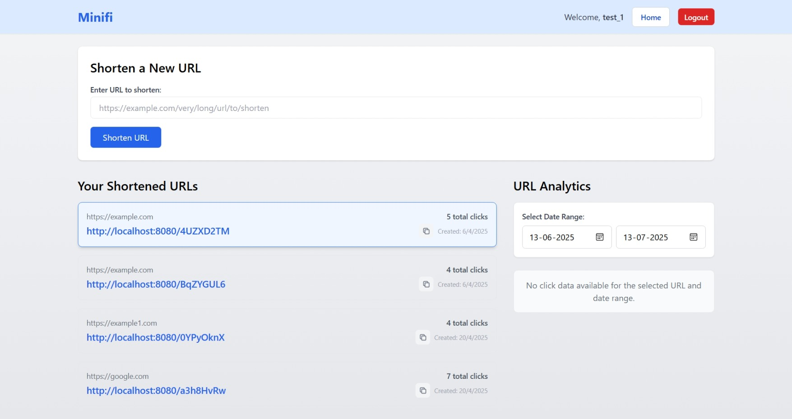
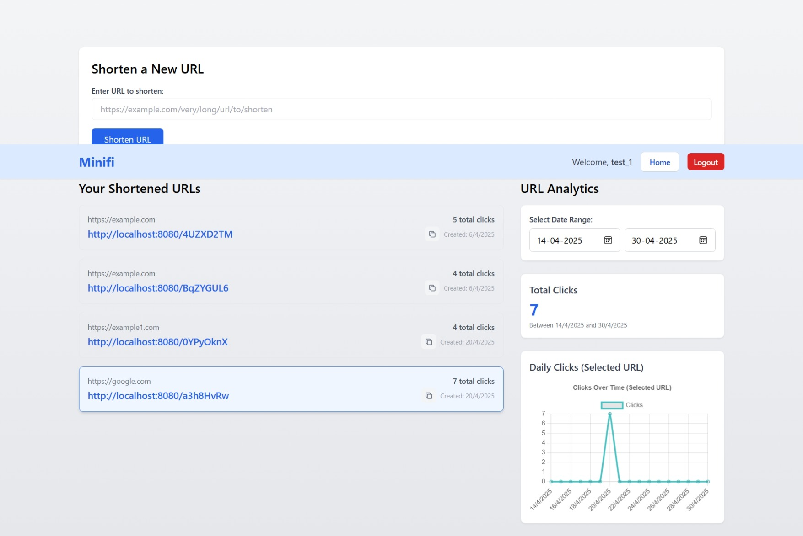

# 🔗 Minifi - URL Shortener (Bitly Clone)

Minifi is a full-stack URL shortener application, similar to Bitly. Users can register, shorten long URLs, and track analytics such as click count and user metadata.

## 🚀 Tech Stack

### 🧠 Backend (Spring Boot)
- Java 17, Spring Boot 3.x
- Spring Security (JWT Auth)
- Spring Data JPA + Hibernate
- MySQL or PostgreSQL
- Maven

### 🎨 Frontend (React)
- React.js with Hooks
- Axios for API calls
- React Router DOM
- TailwindCSS / Bootstrap (if applicable)

## 🔐 Features# 🔗 Minifi - URL Shortener (Bitly Clone)

Minifi is a full-stack, Bitly-like URL shortening service that allows users to register, log in, shorten long URLs, and track detailed click analytics over time. Built with Spring Boot and React, it showcases authentication, security, analytics, and full-stack integration.

---

## 🚀 Tech Stack

### 🧠 Backend (Spring Boot)
- Java 17
- Spring Boot 3.x (REST APIs)
- Spring Security (JWT Authentication)
- Spring Data JPA + Hibernate
- MySQL or PostgreSQL
- Maven

### 🎨 Frontend (React)
- React.js (with Hooks)
- React Router DOM
- Axios (API calls)
- TailwindCSS / Bootstrap (Optional styling)

---

## 🧪 API Endpoints

### 🔐 Authentication (`/api/auth`)
| Method | Endpoint                   | Description                  |
|--------|----------------------------|------------------------------|
| POST   | `/api/auth/public/login`   | User login (JWT response)    |
| POST   | `/api/auth/public/register`| New user registration        |

### 📦 URL Shortening (`/api/urls`)
| Method | Endpoint                       | Description                              |
|--------|--------------------------------|------------------------------------------|
| POST   | `/api/urls/shorten`            | Create a short URL (requires JWT)        |
| GET    | `/api/urls/myurls`             | Get all URLs created by logged-in user   |
| GET    | `/api/urls/analytics/{shortUrl}?startDate=...&endDate=...` | Click stats for one URL (date range) |
| GET    | `/api/urls/totalClicks?startDate=...&endDate=...` | Total clicks per day for user's URLs |

### 🚀 Redirection
| Method | Endpoint            | Description                        |
|--------|---------------------|------------------------------------|
| GET    | `/{shortUrl}`       | Redirects to the original long URL |

---

## 🔐 Authentication & Roles

- Users must register and login to get a **JWT token**
- All `/api/urls/**` endpoints are protected and require the token
- Public endpoints: `login`, `register`, and short URL redirection

---

## 🧑‍💻 Project Structure

minifi-url-shortener/
├── backend/ # Spring Boot code (controllers, services, models)
│ └── src/main/java/com/url/shortener
├── frontend/ # React app (pages, components, styling)
│ └── src/
├── .gitignore
└── README.md


- ✅ User Registration & Login (JWT Auth)
- ✅ Shorten long URLs
- ✅ Redirect using short URLs
- ✅ Track analytics (click count, date)
- ✅ RESTful APIs (secured)
- ✅ Clean UI for interaction


## 🖼️ Screenshots

| Landing Page | Home Page | Shortening Interface | Analytics Page |
|--------------|-----------|----------------------|----------------|
|  |  |  |  |


---

## 📦 Setup Instructions

### 🔧 Backend Setup

1. Navigate to backend:
    ```bash
    cd backend
    ```
2. Configure `application.properties` with your DB and JWT secret
3. Run:
    ```bash
    mvn spring-boot:run
    ```

Backend will start at: `http://localhost:8080`

---

### 🌐 Frontend Setup

1. Navigate to frontend:
    ```bash
    cd frontend
    ```
2. Install dependencies:
    ```bash
    npm install
    ```
3. Start the React app:
    ```bash
    npm start
    ```

Frontend will run on: `http://localhost:3000`

---

## 📌 Todos

- [ ] Add forgot password flow
- [ ] Add pagination to "My URLs"
- [ ] Add preview of URL metadata (title/image)
- [ ] Deploy frontend and backend (Netlify + Render/EC2)

---

## 👤 Author

**Minhajul Islam**  
📎 [GitHub](https://github.com/Minhaj4n)

---

## ⭐ Support This Project

If you found this helpful, feel free to ⭐ star this repo and share it!

